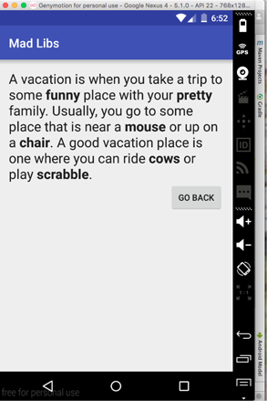

# Mad Libs Android

Implementaion of a Mad Libs practice app from General Assembly Android Development
Immersive course.

The app accepts user input in one activity where they fill out adjectives, nouns,
and the like (you know) for a Mad Libs game. The first activity passes on the
collection of words to a second activity that displays them in a classic Mad Libs
hilarity.



Each EditText field shows an error if the user doesn't fill it out.


It was fun creating a tiny one-time private `Canary` class used to pass into a function
to detect failures. The canary only has a boolean `alive` property that can be set to false.
This needed to be done 

I created the Canary class because I wanted to gather user input and perform error checking
in one pass. At first I had the `putExtraOrFail` method populate an `Intent` object and
return `true` or `false` if it successfully added things or not. 

My original original implementation AND-ed the return value of the function in a series,
which caused trouble. As soon as one method returns false the entire series uses
short-circuit boolean evaluations and won't execute any of the methods again!

```
...java
result = result && putExtraOrFail(...)
result = result && putExtraOrFail(...)
result = result && putExtraOrFail(...)
result = result && putExtraOrFail(...)
...
```

This tiny Canary class is a fun and useful way to detect failures across many function
calls that need to persist state and only die (fail) once yet continue to run.

```java
private class Canary {
  boolean alive = true;
}

private boolean validateInput(Intent intent) {
  Canary canary = new Canary();

  // put extra for every single text field so their errors are set too
  putExtraOrFail(intent, R.id.adjective1_edittext, ResultActivity.ADJECTIVE1, canary);
  putExtraOrFail(intent, R.id.adjective2_edittext, ResultActivity.ADJECTIVE2, canary);
  putExtraOrFail(intent, R.id.noun1_edittext, ResultActivity.NOUN1, canary);
  putExtraOrFail(intent, R.id.noun2_edittext, ResultActivity.NOUN2, canary);
  putExtraOrFail(intent, R.id.animals_edittext, ResultActivity.ANIMALS, canary);
  putExtraOrFail(intent, R.id.game_edittext, ResultActivity.GAME, canary);

  return canary.alive;
}

private void putExtraOrFail(Intent intent, int viewId, String messageId, Canary canary) {
  EditText editText = (EditText) findViewById(viewId);
  String text = editText.getText().toString();

  if (text.length() > 0) {
    intent.putExtra(messageId, text);
  } else  {
    editText.setError("Field must not be empty.");
    intent.putExtra("canary", false);
    canary.alive = false;
  }
}
```

